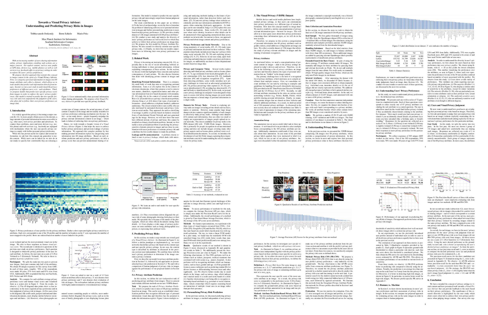

[{:class=”img-responsive”}](https://arxiv.org/abs/1703.10660)

## Abstract
With an increasing number of users sharing information online, privacy implications entailing such actions are a major concern.
For explicit content, such as user profile or GPS data, devices (e.g. mobile phones) as well as web services (e.g. facebook) offer to set privacy settings in order to enforce the users' privacy preferences.

We propose the first approach that extends this concept to image content in the spirit of a _Visual Privacy Advisor_.  First, we categorize personal information in images into 68 image attributes and collect a dataset, which allows us to train models that predict such information directly from images. Second, we run a user study to understand the privacy preferences of different users w.r.t. such attributes. Third, we propose models that predict user specific privacy score from images in order to enforce the users' privacy preferences. Our model is trained to predict the user specific privacy risk and even outperforms the judgment of the users, who often fail to follow their own privacy preferences on image data.

## Resources
  - [Paper](https://arxiv.org/abs/1703.10660)
  - [Poster](http://resources.mpi-inf.mpg.de/d2/orekondy/vpa_poster.pdf)
  - Code (Coming soon)
  - Dataset (Coming soon)
  
## Bibtex
```
@inproceedings{orekondy17iccv,
  title = {Towards a Visual Privacy Advisor: Understanding and Predicting Privacy Risks in Images},
  author = {Tribhuvanesh Orekondy and Bernt Schiele and Mario Fritz},
  year = {2017},
  date = {2017-10-29},
  booktitle = {IEEE International Conference on Computer Vision (ICCV)},
  note = {to appear},
  keywords = {2017},
  pubstate = {published},
  tppubtype = {inproceedings}
}
```

## People
  - [Tribhuvanesh Orekondy](https://www.mpi-inf.mpg.de/departments/computer-vision-and-multimodal-computing/people/tribhuvanesh-orekondy/)
  - [Bernt Schiele](https://www.mpi-inf.mpg.de/departments/computer-vision-and-multimodal-computing/people/bernt-schiele/)
  - [Mario Fritz](https://www.mpi-inf.mpg.de/departments/computer-vision-and-multimodal-computing/people/mario-fritz/)

## Acknowledgement
This research was supported by the German Research Foundation (DFG CRC 1223).
